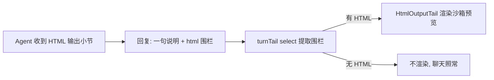

# dsh-html-output

让 DeepSeek Harness 的 Agent **用 HTML 输出富文本而不是 Markdown**，并在 DSH Web GUI 的聊天界面里把 HTML 渲染成实时预览的插件。

```
Agent 回复 (```html fence)
        │
        ▼
┌──────────────────────────────┐
│  简短说明                     │
│  ```html                    │
│  <!DOCTYPE html>…</html>    │
│  ```                        │
└──────────────────────────────┘
        │  dsh-client-html-output 检测到围栏
        ▼
┌──────────────────────────────┐
│  🖥 HTML 渲染输出 [查看源码][新标签][复制] │
│  ┌────────────────────────┐ │
│  │  沙箱 iframe 实时渲染   │ │
│  └────────────────────────┘ │
└──────────────────────────────┘
```

## 特性

- **Host 半（`packages/html-output`，包名 `dsh-html-output`）**
  - 系统提示词小节（order 150）：指导 Agent 在需要富文本/结构化/交互内容时用 HTML 输出，并固定输出契约（一句说明在前 + 单个 ````html```` 围栏 + 不描述 HTML）。
  - `html_render` 工具：Agent 可在落笔前声明/校验一次 HTML 交付（大小上限、标题长度），校验通过后按契约以围栏输出。
- **Client 半（`packages/ui-html-output`，包名 `dsh-client-html-output`）**
  - 注册到 `conversation.chat.turnTail` 链式插槽（纯增量、不遮挡官方 UI）。
  - 收尾助手消息里检测到 ````html```` 围栏（或 `<!--dsh-html-->` 标记）时，在消息下方渲染预览卡片：
    - 沙箱 iframe（`sandbox="allow-scripts"`，无同源权限）实时渲染；
    - 工具栏：渲染预览 / 查看源码、在新标签打开（blob URL）、复制 HTML；
    - 标题自动取自 `<title>` 或首个 `<h1>`。

## 工作原理



- 所有 HTML 都在**助手消息正文**里，随会话日志持久化：回放、复制链接、分支都天然一致，不需要额外的存储或事件。
- 预览 iframe 只开放 `allow-scripts`（交互 HTML 可运行），不开放 `allow-same-origin`（内容无法访问宿主页面），安全隔离。
- 纯函数（`extract.ts`）与组件分离，逐项单元测试覆盖。

## 安装

### 1. 构建

```sh
pnpm install
pnpm build        # 产出 packages/*/lib
pnpm test         # 单元测试
```

### 2. 挂载 Host 半

在 DSH 的 cordis 组合（如 `cordis.yml`）中加一行：

```yaml
- name: dsh-html-output
  config:
    enabled: true
    promptOrder: 150
    maxHtmlBytes: 524288
```

并把 `packages/html-output` 安装进 DSH 的依赖树（本地 link 或发布后 `pnpm add`）。

### 3. 挂载 Client 半

在 web-app bundle 的 `cordis.patch.yml` 中加入浏览器插件行：

```yaml
- id: ui-html-output
  name: dsh-client-html-output
```

同时在 bundle 的 `package.json` 依赖中加入 `dsh-client-html-output`（与内置 `dsh-client-ui-trajectory` 等插件同一机制），然后重启 web。

> 以 deepseek-harness 源码 checkout 为例：在 `packages/bundle/web-app/cordis.patch.yml` 加上述行，`packages/bundle/web-app/package.json` 加依赖，host 行加到你的 `cordis.yml`；之后 `pnpm install && pnpm build:web` 并刷新 GUI。

## 使用

装好后，Agent 在需要富文本输出时会自动采用 HTML。示例回复：

````markdown
统计报表如下。

```html
<!DOCTYPE html>
<html lang="zh-CN">
<head><meta charset="utf-8"><title>销售报表</title>
<style>table{border-collapse:collapse}td,th{border:1px solid #999;padding:6px}</style>
</head>
<body><table>…</table></body>
</html>
```
````

聊天界面会在该消息下方直接渲染这份 HTML。

## 配置

| 字段 | 默认 | 说明 |
| --- | --- | --- |
| `enabled` | `true` | 是否注册提示词小节与工具 |
| `promptOrder` | `150` | 系统提示词小节的顺序（工具指导带 100–199） |
| `maxHtmlBytes` | `524288` | `html_render` 单次校验的 HTML 大小上限（超限建议写文件） |

## 项目结构

```
packages/
  html-output/        # Host: 提示词小节 + html_render 工具
    src/section.ts    #   输出契约文本
    src/tool.ts       #   工具校验/回执（纯函数）
  ui-html-output/     # Client: 聊天渲染预览
    src/client/extract.ts        #   围栏/标记提取（纯函数）
    src/client/HtmlOutputTail.tsx#   预览卡片组件
    src/client/html.ts           #   文档包装 + 剪贴板
```

## 开发

```sh
pnpm test:watch      # vitest watch
pnpm typecheck       # 两包 tsc --noEmit
```

- Client 包由 tsdown 打成 `lib/client.js`（`window.__ModuleLoader__.load` 交接格式），平台模块（react、cordis、runtime 等）保持 external，由 DSH 模块表提供。
- 所有对 DSH 的依赖均以 type-only import 引入，bundle 内不复制任何 DSH 运行时实例。

## License

MIT
